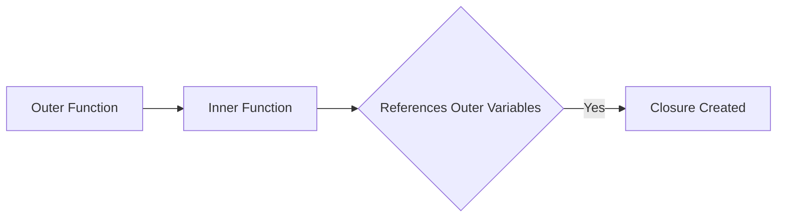

JavaScript closures are one of those concepts that feel *mystical* at first glance but become **indispensable** once you master them.
A closure is simply a **function that remembers the environment** in which it was created—even after that outer scope has finished executing.

## What is a Closure?

When an inner function references variables from an outer function, the JavaScript engine keeps those variables **alive**.
The inner function gains permanent access to them, forming a *closure*.



## Why Should You Care?

- **Data privacy** – emulate private variables without classes.
- **Partial application / currying** – pre‑load functions with some arguments.
- **Asynchronous callbacks** – preserve state in `setTimeout`, Promises, event handlers.

> **Side note:** every React hook you write (`useState`, `useEffect`, etc.) relies on closures under the hood.

## Example 1 — Counter Factory

```js
function createCounter(initial = 0) {
  let count = initial;

  return {
    inc() { return ++count; },
    dec() { return --count; },
    get() { return count; }
  };
}

const counter = createCounter();
console.log(counter.inc()); // 1
console.log(counter.get()); // 1
```

The variable `count` lives on, even though `createCounter` has finished.

## Example 2 — Event Handlers

```js
for (var i = 0; i < 3; i++) {
  setTimeout(() => console.log(i), 0); // prints 3,3,3 🚨
}

for (let i = 0; i < 3; i++) {
  setTimeout(() => console.log(i), 0); // prints 0,1,2 ✅
}
```

Because `var` is function‑scoped, each callback closes over the **same** `i`.
Using `let` creates a new binding per iteration, so each closure gets its own `i`.

## Pitfalls & Best Practices

1. **Accidental memory leaks** – long‑lived closures may hold large objects alive.
2. **Overusing globals** – not every shared state should be a closure; sometimes a module or class is clearer.
3. **Debugging complexity** – variables can change between the time a closure is created and executed.

| ✅ Good | 🚫 Bad |
|--------|-------|
| Create small, purposeful closures | Hide unrelated logic |
| Document captured variables | Implicitly rely on mutated outer state |
| Dispose listeners when done | Leave long‑running timers |

---
